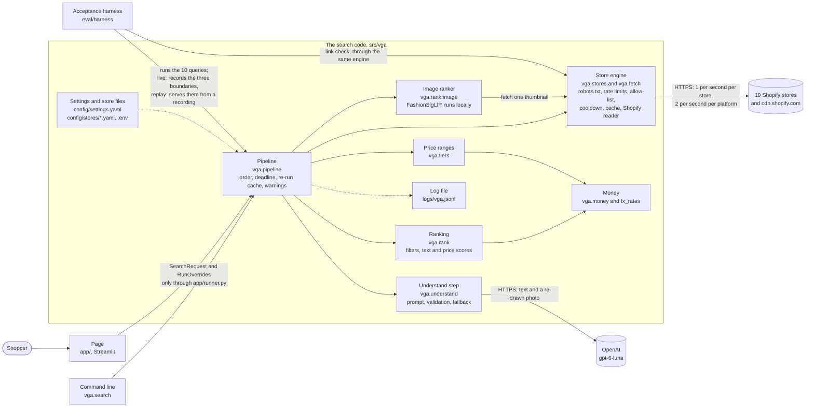

# Architecture

> Written 2026-10-08 against `develop` at commit `5ee891d` (plan feature 16.2.2). Every statement
> was checked against the source file named beside it. Nothing here was run against a live store or
> OpenAI to write it. Speeds quoted from real runs come from `CHANGELOG.md` and say so. Where
> something was not verified, the text says so. The store counts, the speed arithmetic and the
> coverage note were updated later the same day, when six more stores were enabled; the rest was not
> re-checked.

This document is the picture of how the system is built. It replaces section 4 of
[the plan](plans/2026-10-07-vga-ai-shopping-agent-implementation-plan.md), which was written before
the build and no longer matches it everywhere (see "Where this differs from the plan"). The plan
says how the work was ordered. This says what exists.

## What the system is

A shopper types a request (English or Arabic), uploads a photo, or does both. One OpenAI call turns
the request into "what to look for". The app then asks up to nineteen online stores for their
products, ranks what came back, and shows up to 30 results in four price ranges: Budget, Mid-range,
Premium and Luxury. Every result links to the store's own product page.

It is one Python process on one laptop. It has no database, no accounts and no hosting. All nineteen
enabled stores are Shopify storefronts, read through their public `/search/suggest.json` endpoint
(10 products at most per call). Eleven stores are in the UAE (AED prices) and eight are in Kuwait
(dinar prices, shown with an approximate AED figure). There are five garment categories: tops,
outerwear, bottoms, shoes, and dresses (which includes gowns, kaftans, abayas and kurtas).

## The parts and the direction of calls

How to read it:

- Solid arrows are calls. Dotted arrows are configuration read and log lines written.
- The pipeline reaches OpenAI, the stores and the image model only through three small interfaces
  (`Understander`, `StoreSearcher`, `ImageRanker` in `src/vga/interfaces.py`). That is why tests
  fake only those three, and why the harness can record and replay them.
- The page never calls the pipeline directly. `app/runner.py` is the one place that does.
- The image ranker does not make web requests itself. It is handed the store engine's thumbnail
  fetcher, so thumbnails obey the same rules as search pages.
- `src/vga/models.py`, `interfaces.py` and `errors.py` are the shared contracts. They were frozen
  after Phase 1. A change to one is its own pull request that updates every user.

## What each part does, and the one rule it must not break

| Part | Where | What it does | The rule it must not break |
|---|---|---|---|
| Page | `app/` | Takes the photo and text, shows what the AI detected as editable chips, asks "Who is this for?", shows four price ranges of cards, warnings, skipped stores and plain errors. | Never show a string from a store or the shopper as markup or HTML, and never a stack trace. Never keep the photo after its search. Never lose the shopper's input on an error. |
| Pipeline | `src/vga/pipeline/` | Runs the steps in order, owns the 30-second deadline, keeps the re-run cache, collects warnings, builds the `SearchResponse`. | No silent fallback. Every one is logged at warning level with the request id and appears in the response's `warnings`. It raises only when there is nothing to search, or nothing to search with. |
| Understand | `src/vga/understand/` | One OpenAI call (photo and/or text in, structured result out), the versioned prompt, in-code validation of the answer, one corrective retry, the raw-words fallback, the daily call cap, chip edits applied with no call. | The model's answer is untrusted. Nothing it says reaches a store search or the page unless code has re-checked it. A guessed gender is never applied. |
| Store engine and fetch | `src/vga/stores/`, `src/vga/fetch/` | Reads robots.txt, paces requests, checks every address against the store's allow-list, detects a refusal, runs the Shopify reader, caches answers, fetches thumbnails. The only code that talks to a store. | Never contact anything but an https address on the store's `allowed_hosts`. Never get round a refusal (robots.txt, 401/403/429, challenge page, login): make no second request and leave the store alone for its cooldown. |
| Shopify reader and record checks | `src/vga/stores/extractors/`, `normalise.py`, `prices.py` | Turns one store response into validated `Product`s. | Store data is data. A record that lacks a required field, or links off the store's own site, is dropped, never repaired. |
| Ranking | `src/vga/rank/` (not `image/`) | Hard filters, category from the title, text score, price score, one-sentence reason, combined total. All pure functions. | No network, no model, no clock. A product is never dropped for being over budget (it is flagged). The reason sentence uses only facts the code holds. |
| Image ranker | `src/vga/rank/image/` | Embeds the shopper's photo and up to 40 thumbnails with the local FashionSigLIP model and scores their likeness from 0 to 1. | It is a nudge, never a filter. It never raises: on any failure the products simply get no image score. It never keeps the photo. |
| Price ranges | `src/vga/tiers/` | Cuts the candidates into four ranges at quartiles of this search's prices, fills each range to its target, caps each store at 6 results, labels thin ranges. Pure. | Each range shows its real price span. A thin range borrows only from the range next to it. Nothing is invented or re-scored. |
| Money and settings | `src/vga/money.py`, `src/vga/settings.py` | Fixed-rate conversion into AED, price text, one validated settings object. | A currency with no rate is never converted. A bad setting stops start-up with a message naming the field. Model and image-model versions must be pinned, never an alias. |
| Logging | `src/vga/log.py` | One JSON line per event with the request id. | Never write a secret or image bytes. |
| Acceptance harness | `eval/harness/` | Runs the 10 frozen queries, scores them against the pass rule, records and replays runs, writes the labelling sheet. Not part of the running app. | Reach the stores only through the store engine. A mock or replay run contacts nothing. A live run is paced and reports a throttled query as "not run", not "failed". |

## The path of one request

The eight steps below are the ones the page shows as progress (`Step` in `src/vga/models.py`).

### On the page

The search button stays off until there is a valid input. The page checks the photo by its first
bytes and its size, and the text length. That only spares the shopper a round trip; the check that
counts is step 1. While a search runs, every control is disabled. The page builds a `SearchRequest`
and calls `runner.run_search`, which runs the pipeline in its own event loop.

### 1. Validate (`pipeline/validation.py`)

Nothing outside the process is called before this passes.

- Text: at most 2,000 characters.
- Photo: it must start like a JPEG, PNG or WebP (the file name is ignored), be at most 8,000,000
  bytes, at least 8 px on its short side, at most 16,000 px on its long side and 50 million pixels.
  Only the header is read.
- A request needs text or a photo. A "search again" needs the earlier understanding.

### 2. Understand (`understand/`)

There are two ways through this step.

**A new search: one OpenAI call.**

- The text is cleaned of control characters and of anything that could close its `<user_text>` block.
- The photo is decoded, turned upright, redrawn from its pixels alone (so no camera data, GPS, colour
  profile or hidden comment can travel with it), shrunk to 1,024 px on the long edge and sent as a
  JPEG.
- The system message holds the prompt (`understand-v2`, a versioned file). The user message holds the
  shopper's data. They are never mixed.
- The call asks for a strict JSON schema, sets `store=false`, reasoning effort `low`, at most 3,000
  output tokens, 15 seconds per call.
- At most 2 calls per request, counting both kinds of retry: one after a 429, a 5xx or a timeout
  (with backoff), and one corrective retry after an answer that fails validation. A daily cap of 200
  calls per process fails closed.
- Code then re-checks every field of the answer (see "Where untrusted input enters").
- If the model path fails, a request with text falls back to the shopper's own cleaned words as one
  keyword (if they name a garment) and says so in a warning. A request with only a photo gets a
  plain error, because there is nothing to fall back on.
- The kind of request (text, product photo, outfit photo, photo and text) is decided by code from
  facts: photo or not, typed text or not, number of garments found. The model's own label is ignored
  (ADR 0009).

**A search again** (chip edit, price-mix change, answer to "Who is this for?"): the earlier
understanding is reused, chip edits are applied by code, keywords are rebuilt, and OpenAI is not
called. No photo is needed.

**Planning** follows, still before any store is asked:

- The budget is the chip's, else the sidebar's, else the one understood. The price-range mix is the
  sidebar's, except that "cheaper" with no budget switches to the Value-first mix.
- A guessed gender is noted in a warning and not applied.
- The active stores are those with `enabled: true` in a searched country (`AE`, plus `KW` through
  `extra_store_countries`).
- For each garment, a store is asked only if it sells that category and, when the shopper stated a
  gender, sells for it (ADR 0007). A store left out gets the reason "Not searched: ... does not
  sell ...".
- An outfit photo gets one keyword variant per garment.
- The re-run cache is looked at (see "What is cached").

### 3. Search (`stores/engine.py`, `fetch/`)

Each pair of garment and store is its own task, and all are started together. For one store:

1. Cooldown check, then the engine cache. A hit makes no request.
2. The store's robots.txt verdict (cached; read at start-up). Not allowed, or unreadable: stop.
3. Build the URL: the first keyword variant, percent-encoded, into the store's template.
4. Check the URL against the store's `allowed_hosts` (https only, default port, no IP address, no
   local name). Wait for a slot in the rate limiters. Send with the honest User-Agent, 6 seconds,
   response capped at 2,000,000 bytes, at most 3 redirects, each redirect re-checked and its target's
   robots.txt read first.
5. A 401, 403 or 429, a redirect to a login page or a bot-challenge page means "blocked": stop, no
   retry, start the cooldown.
6. Read the JSON with the Shopify reader and check every record (required fields, price format,
   links on allowed hosts, product link on the store's own site, duplicates).
7. A second keyword variant is sent only if the first gave fewer than 5 usable products. Never a
   third.

Checked here: addresses, robots.txt, size, time, status, every record. The pipeline waits for stores
in order but never lets a slow one hold back the rest: at the deadline, the stores that did answer
still count.

### 4. Filter (`rank/filters.py`, `rank/text.py`, `rank/price.py`)

Everything the stores returned is filtered and scored on text and price.

- Dropped: out of stock, a garment outside the five categories (a bag, a sheila, a jumpsuit), the
  wrong category, and, when the shopper stated a gender, a children's item or an item that clearly
  names the other gender (read from the store's own fields, else from the title: ADR 0014). A product
  that cannot be placed in a category is kept without a category bonus.
- The category comes from the product's title. The store's own label is used only if the title says
  nothing.
- Over budget is a flag, not a filter.

### 5. Rank

Per garment, the best matches are chosen for the photo comparison: at most 40, at most 10 from any
one store. If there is nothing to compare (no photo, an outfit photo, the image ranker off), the
totals are final here: anything below the minimum total of 0.2 is removed and the rest is put in
order.

### 6. Image rank (`rank/image/`)

Only for a product photo or a photo with text. An outfit photo skips this step (ADR 0008).

- The thumbnails are fetched through the store engine: robots.txt of the image host, 5 per second per
  host, 4 seconds each, no retry.
- Each thumbnail is decoded (Pillow, size-checked), embedded by FashionSigLIP, and compared with the
  photo's embedding. The cosine is mapped to 0-1 (0.45 or less is 0, 0.90 or more is 1).
- The totals are recomputed with weights text 0.5, image 0.3, price 0.2. A product that was not
  compared gets the average image score of the compared ones, so being compared is never a penalty.
  Anything below the minimum total of 0.2 is removed.
- The photo is dropped here. Only its embedding (numbers) is kept, for "search again".

### 7. Shape (`tiers/`)

- All prices are put in AED (a dinar price is converted at the fixed rate).
- Borders are the quartiles of this garment's candidate prices.
- The mix becomes counts that sum to the total (30 for a normal search, 12 per garment for an outfit).
- Each range takes its best-scoring products, no store supplies more than 6 in all, and a range that
  falls short borrows from its neighbour, or shows fewer results and a "few options" flag.
- With a budget, Budget and Mid-range hold only products within it. Premium and Luxury may exceed
  it, flagged "over budget".

### 8. Assemble

The response lists the stores used and the stores skipped (each with a plain reason), the warnings,
the token usage, the timings, and the photo's embedding. What can be reused is remembered in the
re-run cache. Back on the page, the uploader is released so the file is dropped, and "Who is this
for?" is asked if some garment's gender was guessed or not found (ADR 0011).

### The deadline

The whole request has one deadline: 30 seconds (`request_deadline_s`). When it passes, whatever is
still running is cancelled and the response is built from what each step had finished, with a
warning. The one exception: if the request has not been understood by then, there is nothing to show
and the shopper gets a plain "took too long" error (ADR 0013).

## What is cached, where, and for how long

Everything is in memory in the one process. Nothing is written to disk except the log file
(`logs/vga.jsonl`), a dump of the ranked candidates (only if switched on), and the image model's
weights, which are downloaded once, ahead of time, into the Hugging Face cache.

| What | Where | Kept for | Notes |
|---|---|---|---|
| Parsed robots.txt, per host | `RobotsChecker` | 24 hours | An unreadable robots.txt is remembered for 900 seconds as "everything disallowed", so it is not asked for again on every search. A block while fetching it is not remembered. The stores' files are read when the page opens. |
| Store search answers | `ResultCache` in the store engine | 600 seconds | Key: store and normalised keyword. Only "ok" and "empty" answers are kept. At most 256 entries. |
| The re-run cache | `RerunCache` in the pipeline | Latest 32 requests; each item's products reusable for 600 seconds | Holds the products, image scores and per-store reports of finished searches, plus the photo's embedding. The 600 seconds count from when the oldest store answered, and reuse does not renew them. The embedding stays until the entry is pushed out or the process stops. |
| Cooldowns and rate-limiter state | `PoliteClient` | 900 seconds per cooldown | A store, a whole platform, or an image host can be cooling down. |
| The image model | `get_embedder` | Until the process stops | Loaded once when the page opens (about 3 s warm, about 10 s cold). |
| The daily OpenAI call count | `process_call_budget()` | Until UTC midnight | In memory, so a restart resets it. |
| The pipeline itself | `st.cache_resource` | Until the process stops | The re-run cache lives on this one instance. |
| The latest response | Streamlit session state | The browser session | Holds the embedding, never the photo. |
| The shopper's photo | The uploader widget only | Until the search that used it finishes | Then the uploader gets a new key and Streamlit lets go of the file. A failed search keeps the photo so the shopper can retry. |
| Not cached at all | | | The Understand answer, thumbnails, the photo. |

## What is rate-limited, and how

All limits are on the injected clock (`Clock`), so tests do not wait.

| What is limited | Limit | How |
|---|---|---|
| One store | 1 request per second (`rps_per_store`; a store file may set its own `rps`) | One queue per store, shared by every host of the store's own site (the bare domain and `www.`, say), and by its robots.txt. A robots.txt `Crawl-delay` can only slow it down. |
| One platform | 2 requests per second in total (`rps_per_platform`) | All nineteen stores are Shopify, so they share one queue (`platform:shopify`, `fetch/platform.py`). Only requests to a store's own site count. Slots are handed out in the order they are asked for, so every store gets its first request out before any gets its second. |
| An image host | 5 requests per second (`rps_images_per_host`) | One queue per host, shared by every store that uses it (`cdn.shopify.com`). At most 40 thumbnails per search, at most 10 per store. |
| Keyword variants | 1 per garment per store; a second only if the first gave fewer than 5 usable products; never a third | `StoreSearchEngine._search_variants`. |
| OpenAI | At most 2 calls per request, a daily cap of 200 per process | `understand/gateway.py`, `understand/budget.py`. |
| After a refusal | 900 seconds with no contact | A 401, 403 or 429, a login redirect or a challenge page stops that store at once, with no retry. A 429 from a store's own site also stops every store on the platform and drops the requests still waiting in the queue. A `Retry-After` is obeyed (capped at 24 hours). An error or a timeout does not start a cooldown. |

Time limits sit beside these. Each request: 6 seconds (thumbnails 4). Each store's whole search:
6 seconds times the number of keyword variants it may be sent (at most 2) plus one for robots.txt,
counting only time spent working. Time spent waiting in a queue is not counted, because a request
waiting its turn has not started. The OpenAI step as a whole gets 20 seconds. The request as a whole
gets 30 seconds, and its clock never pauses.

## When something outside fails

| What fails | What happens | What the shopper sees |
|---|---|---|
| OpenAI times out, answers 429 or 5xx | One retry with backoff (inside the 2-call cap). Then the fallback. | With text: a warning that the words were searched as typed. With only a photo: a plain error. |
| OpenAI's answer is not valid | One corrective retry that names the broken fields (never the values). Then the fallback. | As above. |
| OpenAI refuses, or the key is wrong | No retry for a 4xx. The fallback. | As above. A missing key or model is named when the page opens. |
| The daily call cap is reached | No call is made. | A plain "daily limit" error. |
| The request holds nothing to shop for (a handbag, nonsense) | No search. | A plain message that names the five categories. |
| One store is slow, broken or empty | Its own status; the others are untouched. | The store is listed as skipped with a reason, and named in a warning if it failed. |
| A store refuses (403/429/challenge/login) | One request only, then cooldown. | "This store did not allow the search, so we skipped it." |
| robots.txt forbids the search, or cannot be read | No search request is sent. | "This store asks automated tools not to search it." |
| A 429 from the platform | Every store on the platform is paused, queued requests are dropped. | Those stores are skipped. |
| Every store fails or finds nothing | An empty result. | "No results right now", with tips and the skipped stores. |
| The image model is missing, crashes, or a thumbnail fails | The affected products get no image score. | A warning that results are ranked by text and price only. |
| The 30-second deadline passes | Unfinished work is cancelled, the rest is shaped. | A warning that some results may be missing. Before understanding finishes: an error. |
| A bug in one store's code path | That store gets status "error"; the others are untouched. | The store is skipped. |
| A bug anywhere on the page | The error boundary logs it with the request id. | A generic message, never a trace. The photo and text stay in their boxes. |
| A store file or a setting is invalid | The settings or the store files are refused as a whole, and every problem is listed together. | A message naming the file or field. |

## Where untrusted input enters, and how it stays data

Instructions live in one place only: the system prompt. Everything else is data.

| Entry point | Checked how | Why it stays data |
|---|---|---|
| The shopper's text | Length cap; control characters and any `<user_text>` tag removed; placed inside a labelled block of the user message. | It is never placed in the system message. Raw text is searched only in the fallback, after cleaning. |
| The shopper's photo | Magic bytes, size, dimensions; redrawn from pixels. | Sent only to OpenAI (and embedded locally). Text printed in the photo cannot set a budget or an edit: those need the shopper's typed words. |
| The model's answer | Strict schema, then `validate_reading`: categories and genders must be known values; free text is stripped of URLs, markup and control characters and capped; a run of six words copied from the prompt is refused; keywords lose price words and gender words; a gender counts as stated only if the typed text names it; a budget needs a number the shopper typed, and it must be that number; an edit needs the shopper's typed words. | Nothing it says is a link, a command or markup by the time it leaves. The kind of request is derived by code. |
| A store's response | https, allow-listed host, size cap, JSON only. The Shopify reader maps fixed fields. Every record is validated. | No model ever reads store content. Titles are reduced to single-spaced text. A product link must be on the store's own site, never the shared image host. |
| A store's headers and redirects | Each redirect is re-checked against the allow-list and the same registered domain; a login path is a block; `Retry-After` is capped at 24 hours. | They can only make the app wait longer or stop, never go somewhere new. |
| robots.txt | Parsed by `protego` as rules only. | It is not instructions to the app beyond Allow and Disallow. Comments in it addressed to AI agents are recorded in the store notes as data and not acted on. |
| Thumbnails | Must be an image content type; decoded with a size check. | They are decoded locally, for scoring only. The page does not show those bytes: the shopper's browser loads each picture from the store's image host by its link. |
| What the page shows | Every store or shopper string is shown with `st.text`; the link goes only to `Product.product_url` and opens in a new tab; the button label uses a reduced version of the store name. | Nothing is read as markdown or HTML. |
| Store files and settings | Validated at start-up; every problem in every file is reported together. | They are our own files, but a mistake must stop the app, not slip through. |

One known gap in the address rules: a listed host whose DNS record points at a private address would
not be caught. The host names come from our own store files, so this would need a hostile store
(noted in `fetch/allowlist.py`).

## How a second currency is carried

(ADR 0006)

- A `Product` always keeps the store's own price and currency. The Kuwaiti stores price in dinars
  with three decimals ("245.000"). The parser accepts three decimals only for a store whose currency
  is KWD, BHD or OMR. For an AED store the same text is refused, because there it more likely hides a
  thousands separator.
- `config/settings.yaml` holds a base currency (`AED`) and fixed rates (`fx_rates`). 1 KWD is 11.92
  AED. The source and date sit beside the number. There is no live exchange-rate call.
- Everything that compares prices works in the base currency: the price score, the over-budget flag,
  the reason sentence, the quartile borders, the range spans and the budget.
- The price-range shaper converts, and writes the AED figure onto the shown product as `base_price`
  (only when its currency is not AED). The page converts nothing. It shows the store's price and an
  "about" figure rounded to the nearest 10 AED from 100 AED up, for example `245.000 KWD (about
  2,920 AED)`, with one sentence above the results saying that ranges and budget go by the AED figure.
- A range that holds a converted product has its span widened outward to whole AED, so the header
  does not claim cents from an approximate rate.
- A currency with no rate is never converted. Its products get a neutral price score, no budget
  claim, and are left out of the price ranges, with a plain warning.
- The home market stays the UAE. Kuwaiti stores are searched too, through `extra_store_countries: [KW]`.
- The rate drifts. It must be refreshed by hand before any real use.

## The acceptance harness

`eval/harness/` is not part of the running app. It runs the 10 frozen queries in `eval/data/`,
scores each against the pass rule (at least 20 results from at least 3 stores in 30 seconds or less,
every checked link opening the store's own product page, each price range within one result of its
target or flagged "few options", and a person's judgement that 7 of the top 10 are good matches),
and writes a report and a labelling sheet. The demo passes if at least 7 of the 10 queries pass.

- **Modes.** `--mock` uses the fake pipeline. `--record` runs the real pipeline live and records what
  the three boundaries return. `--replay` re-runs the real pipeline, ranking and price ranges from a
  recording with no network and no model. `--rescore` rebuilds a report.
- **Pacing.** A live run waits 30 seconds between queries and sends at most one link check every
  2 seconds. A query that every store turned away is "not run" (neither pass nor fail), the run stops,
  and the verdict reads INCOMPLETE. `--only` finishes such a run later.
- **The gender question.** A photo query can record the shopper's answer (`shopper_gender`). After the
  first search the harness gives that answer the way the page does (ADR 0011) and scores the second
  search. The 30-second limit is checked against the first search alone.
- **Links** are checked through the store engine, so the check is as polite as the search.

## How it is tested, and what CI runs

There are two suites, and they answer different questions.

- **The complete suite** (`uv run pytest`): about 8,450 tests, three to four minutes, no network and
  no key. It fakes only the outside world: store HTTP, the OpenAI client, the image-model weights
  and the clock. It is run **locally**, before a push or a merge.
- **The critical suite** (`uv run pytest -m critical`): 143 of those tests, about 20 seconds. These
  are the tests whose failure would mean a broken product rule or a broken demo. **This is what CI
  runs**, with `ruff` and `mypy`, on every pull request and on every push to `main`. The dependency
  audit (`pip-audit`) and the secret scan (`gitleaks`) run beside it.

The critical tests are named in one file, `tests/critical_suite.txt`, under fifteen headings: store
access, links and hosts, price words, photo privacy, untrusted text, secrets and errors, the gender
rule, contracts, understanding, store data, ranking, price ranges, the pipeline, the page and the
acceptance harness. A hook in `tests/conftest.py` marks them, and
`tests/foundation/test_critical_suite.py` fails if the list names a test that no longer exists.

Three guard suites under `tests/guards/` run whole requests through the real pipeline: store access
(`scraping/`), photo privacy (`privacy/`) and prompt injection (`injection/`). The critical suite
takes the strongest few from each.

Tests marked `live` talk to the real stores or the real OpenAI API. They never run in CI and are
run by hand, one at a time. The complete suite can also be run in CI by hand (Actions, CI, Run
workflow, `full_suite`). The decision and its cost are in
[ADR 0015](adr/0015-ci-runs-a-critical-suite.md): a regression outside the critical list is caught
only by the local run.

## Trade-offs

Decisions that cost something, and what they cost.

| Decision | What it buys | What it costs |
|---|---|---|
| **Live search instead of an index** (ADR 0001) | Fresh prices and links. No crawler, no database, nothing stored about the stores. | The app can only be as good as each store's own search. Results depend on a store's endpoint staying open. The shopper waits for the stores. Price ranges come from this search's candidates, not the whole market. Stores that disallow search (most large GCC retailers) cannot be read at all. |
| **One request a second per store, plus 2 a second per platform** (ADR 0010) | The burst that made all thirteen stores answer "too many requests" within 11 milliseconds on 2026-10-08 should not recur. One real search under the new limit finished with no refusal. | Speed. Asking all nineteen stores costs about 9.5 seconds of store time by the same arithmetic (19 search requests at 2 a second); that is not measured yet. Thirteen stores cost about 6 to 6.5 seconds, up from about 2. A store is searched only for the categories and genders its file allows, so most searches reach fewer than nineteen. One real text search, with thirteen stores enabled, took 8.4 seconds in all (understanding 4.5, stores 3.8, with some stores not asked). A cold four-garment outfit can reach the 30-second limit and returns what arrived. A full acceptance run under the new limit has not been made. Whether 2 a second is under Shopify's allowance is not known and must not be probed. |
| **One keyword variant per store** (ADR 0010) | Up to 19 search requests per text search instead of up to 57 (three variants each). | A store whose first variant returns 5 or more products never sees the second wording, so recall can be lower. Whether one variant gives enough results on every query is not known. |
| **An inferred gender is never applied until the shopper answers** (ADR 0011) | Rule 8: a guess never filters. | The first results show both genders. A women's outfit photo also returns men's shoes until the shopper answers "Women". The answer costs no request, but it is one more thing to click. |
| **No image comparison for an outfit photo** (ADR 0008) | A real outfit search fell from 30.3 seconds with a timeout to 9.4 seconds. | Outfit results are ranked by text and price only. One photo of a whole outfit would be a weak likeness for one garment's thumbnail anyway. |
| **A fixed exchange rate** (ADR 0006) | No extra service, no failure mode, the same search gives the same ranges twice. | The AED figure is approximate (good to about 1%) and goes stale. The rate must be refreshed by hand. A shopper pays the store's price in dinars. |
| **Dropping a record with several prices rather than guessing** (ADR 0012) | A wrong price range or a false "within budget" is never shown. | Hamsa shows 5 of its 10 abayas. The ones dropped are old, discounted stock, but they are missing. |
| **A store is searched only for what it sells** (ADR 0007) | No wasted request, and no abaya under "shoes". | The list is written from records seen, and "not seen" is not "not sold". A store that adds a new line is missed until its file is edited. |
| **A model with no dated snapshot** (ADR 0002) | The model the user chose. | OpenAI can change what `gpt-6-luna` does without notice. The eval must be re-run from time to time. |
| **All state in memory** | No database, no clean-up, nothing to leak. | A restart loses the re-run cache and cooldowns, and resets the daily OpenAI call count. |
| **A small, Shopify-only store set** | Every store can be read honestly. | Mostly boutiques, not the large retailers a shopper expects. Menswear in the usual categories comes from three stores; men's kurtas, shalwar kameez and dishdashas come from four more (Gul Ahmed UAE, Nishat Linen UAE, Signature Studio and Al Jazeera Clothing), and adult men's thobes are thin. Everyday abayas now come from Veil Essentials (from about AED 142) and Shadow (from about AED 465); that has not been checked on a real search. Nothing is sold as a burqa. |

## Decisions

| ADR | Decision |
|---|---|
| [0001](adr/0001-live-search-not-an-index.md) | Search store pages live. No index or sitemap crawl. |
| [0002](adr/0002-openai-and-fashionsiglip.md) | OpenAI for understanding. Local Marqo-FashionSigLIP for image similarity. |
| [0003](adr/0003-honest-fetching-no-impersonation.md) | Fetch honestly, never impersonate a browser, drop blocking stores. |
| [0004](adr/0004-weighted-score-and-quartile-price-ranges.md) | Rank with a weighted score. Cut price ranges at quartiles of this search. |
| [0005](adr/0005-photo-lifetime-and-embedding-reuse.md) | The photo lives for one request. Only its embedding is reused. |
| [0006](adr/0006-second-currency-fixed-rate.md) | A second currency, converted at a fixed rate for comparison only. |
| [0007](adr/0007-search-a-store-only-for-what-it-sells.md) | A store is searched only for the categories and genders it sells. |
| [0008](adr/0008-image-similarity-only-for-a-product-photo.md) | Image similarity runs for a product photo, not for an outfit photo. |
| [0009](adr/0009-request-kind-decided-by-code.md) | The kind of request is decided by code, not by the model's label. |
| [0010](adr/0010-platform-wide-request-limit-and-one-keyword-variant.md) | Requests are paced across the whole platform. One keyword variant per store. |
| [0011](adr/0011-ask-the-shopper-when-gender-was-guessed.md) | The shopper is asked when the gender was only guessed. The harness answers from the query file. |
| [0012](adr/0012-drop-records-with-several-prices.md) | A record whose variants differ in price is dropped, not corrected. |
| [0013](adr/0013-one-deadline-partial-results.md) | One 30-second deadline. A late store costs only its own answer. |
| [0014](adr/0014-product-gender-from-the-stores-own-fields.md) | Who a product is for is read from the store's own fields, then the title. |
| [0015](adr/0015-ci-runs-a-critical-suite.md) | CI runs a critical suite of 143 tests; the complete suite runs locally. |

## Where this differs from the plan

Section 4 of the plan, and some text near it, no longer matches the code in these places.

- **The diagram.** It shows `Fetch and Extract` as "httpx, robots, 1 rps". It now also has a
  platform-wide queue of 2 requests per second, cooldowns and a result cache. It does not show the
  re-run cache, the image ranker's use of the store engine for thumbnails, the skipped image step for
  an outfit photo, the command line or the harness.
- **"Stateless per request".** The process keeps a re-run cache, a store-answer cache, cooldowns, a
  robots.txt cache, the daily call count and the loaded image model.
- **Contracts.** `ItemIntent.category` has five values, not four. `search_keywords` holds 1 to 3
  variants, not 2 to 3. `SearchRequest` has `rerun_of`. `StoreConfig` also has `name`, `genders`,
  `categories`, `max_response_bytes` and `max_variants`. `Product` has `gender`. `ScoredProduct` has
  `base_price`. `StoreResult` has `dropped` and `detail`. `SearchResponse` has `request_id`,
  `duration_ms` and `query_embedding`, and its store lists are `StoreReport`s. The budget in
  `ChipEdits` is for the whole request, not per item. `RunOverrides` and `QueryImage` are not in the
  table. `input_type` in `UnderstandResult` is derived by code.
- **Extraction strategies.** Only `shopify` is built. The plan's glossary also lists `css`.
- **Mixed currencies.** Section 6 says the shaper "never converts". It converts at a fixed rate
  (ADR 0006).
- **The model.** Section 3 says a dated OpenAI snapshot is pinned. `gpt-6-luna` has no dated
  snapshot, so the versioned name is the pin.
- **Libraries.** Section 3 names `selectolax` and `extruct` as the parsers. Both are declared
  dependencies, but no code imports either. Store responses are read with the standard `json` module.
- **Keyword variants.** The plan and ADR 0001 say 2 to 3 variants per store. It is now one, and a
  second only for a thin answer.
- **The page's data flow.** The page passes `SearchRequest(rerun_of=...)` plus `RunOverrides` (mix,
  chip edits, the earlier understanding, the photo's embedding), not "SearchRequest + ChipEdits".

## What this document does not cover

- It was not checked by running the app. A statement about speed comes from `CHANGELOG.md`, from real
  runs on 2026-10-08, and is not re-measured here.
- The real image model's internals were read, not run.
- A running Streamlit page was not inspected for what Streamlit keeps of an uploaded file. The
  privacy note ([`privacy.md`](privacy.md)) lists what the audit can and cannot see.
- Store terms of use have not been reviewed for any store. See
  [`store-notes/SUMMARY.md`](store-notes/SUMMARY.md).
